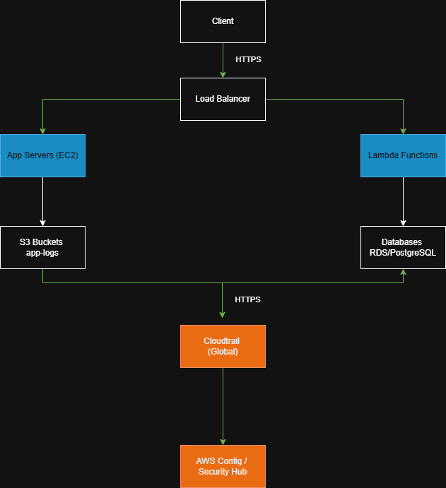

# Security Architecture Review (SAR) - Mock Project

**System:** Web Application (hosted by AWS)  
**Author:** Sharaden Cole  
**Date:** 11-30-25  
**Scope:** Evaluate the AWS environment for the web application, including S3 buckets, IAM roles, and CloudTrail logging. Assess controls against NIST 800-53 and AWS best practices.

---

## Executive Summary
This Security Architecture Review evaluated the web application hosted on AWS. The review identified key areas of concern affecting access control, logging, and data exposure. Risks were quantified on a scale of 1–5 for likelihood and impact, with risk scores calculated as Likelihood x Impact.  

**Top 3 Risks:**
1. Overly permissive IAM policy attached to a development role – Risk Score: 20  
2. Publicly readable S3 bucket containing application logs – Risk Score: 12  
3. CloudTrail not configured in all regions – Risk Score: 8  

These findings highlight the importance of enforcing least privilege, securing data storage, and maintaining consistent logging for audit readiness and operational security.

---

## Architecture Overview

This diagram shows the high-level architecture of the web application, including user access paths, network zones, and AWS services in scope. Trust boundaries were identified around S3 buckets, IAM roles, and logging infrastructure. Data flows were mapped to understand potential attack surfaces and high-risk areas.

---

## Findings (High-level)
| ID | Resource | Likelihood (1-5) | Impact (1-5) | Risk Score (1-25) | Summary | Business Impact | Recommendation |
|----|----------|-----------------|---------------|-----------------|---------|-----------------|----------------|
| 1  | Amazon S3://app-logs | 3 | 4 | 12 | Publicly readable bucket found during scan | Potential data exposure; compliance risk | Set bucket policy to private; enable bucket encryption; enable access logging |
| 2  | IAM:AdminPolicy | 4 | 5 | 20 | Overly permissive admin-like policy attached to dev role | Potential for privilege escalation and data exfiltration | Apply least privilege; create scoped roles; implement permission boundaries |
| 3  | Cloudtrail | 2 | 4 | 8 | CloudTrail not configured in all regions | Gaps in audit logging may hinder incident response | Enable CloudTrail in all regions and centralize to logging account |

---

## Detailed Findings

### Finding 1: Amazon S3://app-logs
- **Resource:** s3://app-logs  
- **Evidence:** Public READ permissions observed via `aws s3api get-bucket-acl --bucket app-logs`  
- **Likelihood:** 3  
- **Impact:** 4  
- **Risk Score:** 12  
- **Business Impact:** Potential data exposure and compliance risk if logs contain sensitive information  
- **Recommendation:**  
  - Enforce S3 bucket policies to block public access.  
  - Enable default bucket encryption using AWS KMS.  
  - Enable S3 access logging and centralize logs in SIEM (Security Hub/CloudWatch Logs).  
  - Implement AWS Config rules to continuously monitor bucket compliance.  
  - Use Service Control Policies (SCPs) to prevent creation of non-compliant buckets.  
- **Owner:** Cloud Ops  
- **Target Date:** 12-15-2025  
---

### Finding 2: IAM: AdminPolicy
- **Resource:** IAM role with Admin-like policy attached  
- **Evidence:** `aws iam list-attached-role-policies` showed overly permissive policy  
- **Likelihood:** 4  
- **Impact:** 5  
- **Risk Score:** 20  
- **Business Impact:** High potential for privilege escalation and data exfiltration  
- **Recommendation:**  
  - Apply least privilege to all roles and enforce permission boundaries.  
  - Use IAM Access Analyzer and Security Hub for continuous monitoring of risky policies.  
  - Automate alerts for newly created or updated policies exceeding defined risk thresholds.  
  - Enforce baseline policies using Terraform or CloudFormation for reproducibility.  
- **Owner:** IAM Team  
- **Target Date:** 12-1-2025  

---

### Finding 3: Cloudtrail
- **Resource:** CloudTrail logging  
- **Evidence:** Logging not enabled in all regions; reviewed via `aws cloudtrail describe-trails`  
- **Likelihood:** 2  
- **Impact:** 4  
- **Risk Score:** 8  
- **Business Impact:** Incomplete audit trail could hinder incident response and regulatory compliance  
- **Recommendation:**  
  - Enable CloudTrail in all regions and centralize logs to a dedicated logging account.  
  - Enable log file integrity validation and multi-region trails.  
  - Integrate automated alerts via CloudWatch or Security Hub if logging stops or fails.  
  - Forward logs to SIEM for continuous monitoring and audit readiness.  
  - Use AWS Config to ensure all accounts maintain active trails with automated remediation for non-compliance.  
- **Owner:** Security Ops  
- **Target Date:** 12-15-2025

---

## Risk Register

| ID | Resource | Description | Likelihood (1-5) | Impact (1-5) | Risk Score | Business Impact | Recommendation | Owner | Status | Target Date |
|----|----------|-------------|-----------------|---------------|------------|-----------------|----------------|-------|--------|-------------|
| 1  | s3://app-logs | Publicly readable bucket found during scan | 3 | 4 | 12 | Potential data exposure and compliance risk if logs contain sensitive information | Restrict public access with bucket policies; enable default encryption with AWS KMS; enable access logging and forward to SIEM; enforce compliance via AWS Config rules and Service Control Policies | CloudOps | Open | 2025-12-15 |
| 2  | iam:AdminPolicy | Overly permissive admin-like policy attached to dev role | 4 | 5 | 20 | High potential for privilege escalation and unauthorized data access | Apply least privilege; implement permission boundaries; continuously monitor with IAM Access Analyzer; configure automated alerts via Security Hub; enforce baseline IAM policies with Terraform or CloudFormation | IAM Team | Open | 2025-12-01 |
| 3  | cloudtrail | CloudTrail not configured in all regions | 2 | 4 | 8 | Incomplete audit trail could hinder incident response and regulatory compliance | Enable CloudTrail in all regions and centralize logs to dedicated logging account; enable log file integrity validation; implement automated alerts with CloudWatch/Security Hub; integrate logs into SIEM for continuous monitoring; enforce compliance via AWS Config rules | SecurityOps | Open | 2025-11-30 |

---

## Remediation Plan & Prioritization (GRC Engineering Focused)

- **Short-term (0–30 days):**  
  - Enable CloudTrail in all regions and centralize logging.  
  - Restrict public S3 bucket access, enable default encryption, and configure AWS Config rules.  
  - Assign owners for each finding and automate alerts for violations.

- **Medium-term (30–90 days):**  
  - Review IAM roles and enforce least privilege.  
  - Implement permission boundaries and integrate continuous monitoring (IAM Access Analyzer, Security Hub).  
  - Automate remediation workflows with Lambda/EventBridge for misconfigured S3 buckets or IAM roles.

- **Long-term (>90 days):**  
  - Establish a **continuous GRC Engineering pipeline**: automated checks in CI/CD (Terraform/CloudFormation), centralized risk register updates, and automated reporting for leadership.  
  - Implement recurring SAR processes with automated evidence collection and compliance dashboards.

---

## Conclusion
This mock SAR demonstrates how GRC Engineering can enhance compliance through **automation, continuous monitoring, and enforceable policies**. By applying technical controls, monitoring, and automated remediation, the organization can reduce risk exposure, strengthen its security posture, and maintain audit readiness in cloud environments.
